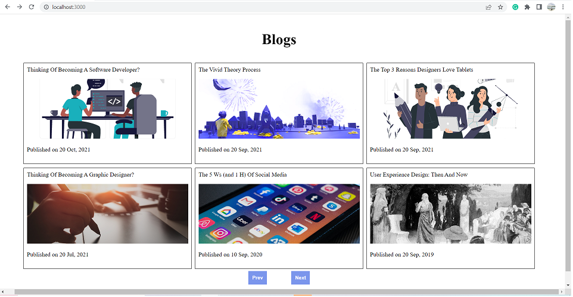
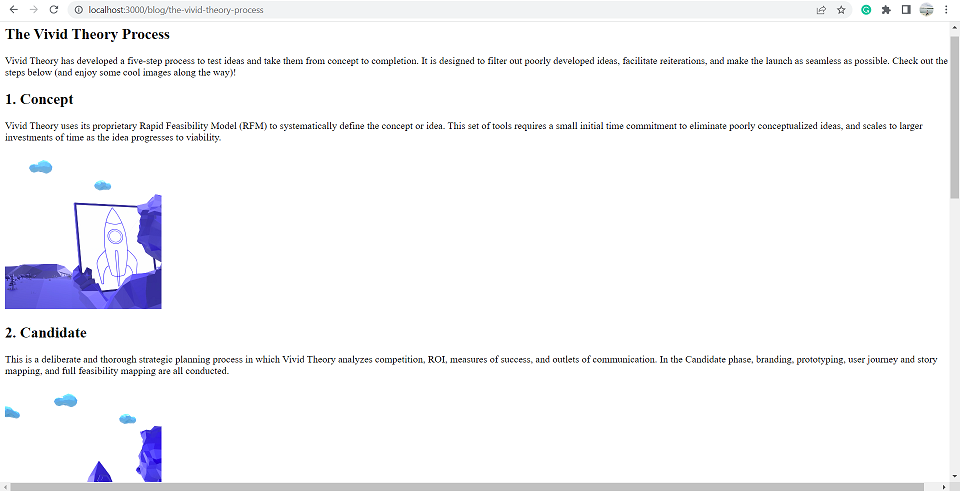

# Blogs

This project has two pages. The first page will show a list of blogs (a maximum of 6 blogs at a time). We can see more blogs with the help of the `prev` and `next` buttons. Upon clicking that blog, we will navigate to that particular blog page where we can read about that blog.

## Setup

- clone back-end from: <https://github.com/harwindersidhu/challenge-blogs-backend>
- Install dependencies with `npm install`.

### `npm start`

Runs the app in the development mode.\
Open [http://localhost:3000](http://localhost:3000) to view it in your browser.

## Screenshots

- Home page, where we can see list of blogs.

  - 

- When we select a blog from a list, we will navigate to that particular blog page.
  - 

# Dependencies

- ReactJS
- JavaScript
- Axios
- Node.js
- useContext
- React Router
- Sass
